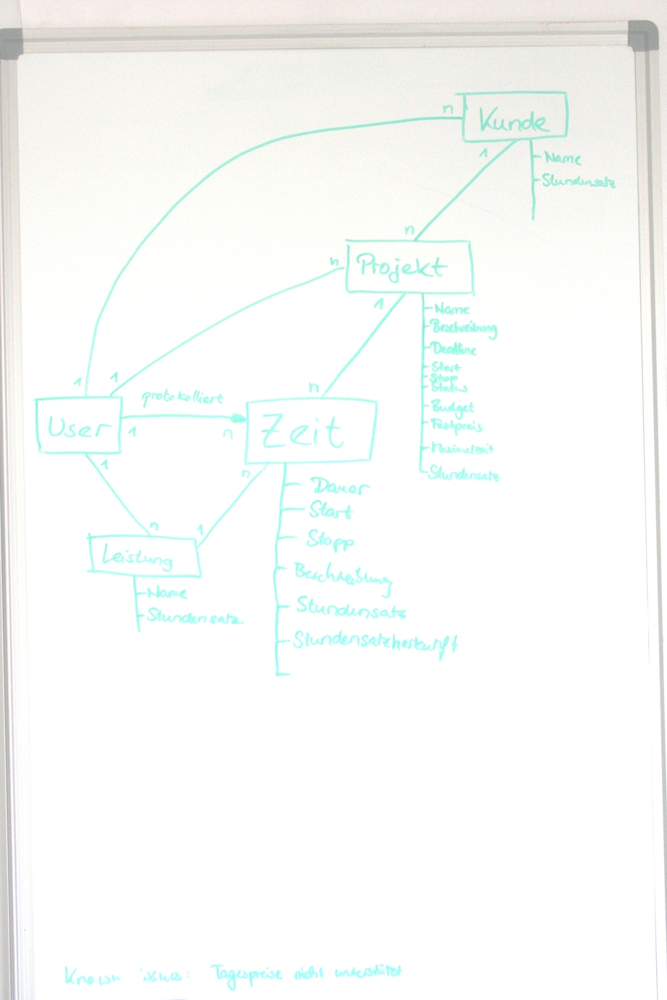

Introduction
============

About DimeTimetrackerBundle
---------------------------

The DimeTimetrackerBundle provides entities and a JSON REST API for
time-tracking activities. Those activities can be services (such as
development, testing, support or consulting) provided for a customer within a
project.

The DimeTimetrackerBundle aims to become a multi user application to allow
enterprises or any teams to track their times.

Installation
------------

There is no separate repository for the bundle yet. It will be available as of
release 1.0. Installation instructions will follow.

By now, please refer to the Dime_ project repository.

Accessing the API
-----------------

The API is available via HTTP as a JSON REST API.

To make the API available, install the DimeTimetrackerBundle and point your
webserver to the ``web`` directory of your project.

For short reference on available URIs type for the production environment call

.. code-block:: bash

    ./app console router:debug --env=prod

Further details can be found in this documentation.

Data structure
--------------

The DimeTimetrackerBundle provides the following entities:

* Activity
* Customer
* Project
* Service
* Timeslice
* User

A user is the person logging in into the application. The user provides
services (such as development, testing, support or consulting) and works in
projects that usually belong to a customer (or any other project owner).

An activity is a group of time slices of a user that refers to a
service, a project and a customer.

   ERM visualizing the entities

TODO: replace ERM with add Workbench schema (depends on `Issue #36`_)

Multi User Mode
---------------

The DimeTimetrackerBundle aims to become a multi user application to allow
enterprises or any teams to track their times.

The first step towards this will be a better authentification using the
JMSSecurityExtraBundle_.

A second step could be shared projects.

Writing bundles based on DimeTimetrackerBundle
----------------------------------------------

Writing bundles that are based on or extend DimeTimetrackerBundle is
possible and desired. The official Symfony 2 documentation is a good
reference to start on how to use or override Bundles. If you like, contact
us to share ideas.

Extending enities
~~~~~~~~~~~~~~~~~

* https://groups.google.com/group/symfony-users/msg/b85f00ead1bab22e
* https://github.com/FriendsOfSymfony/FOSUserBundle/blob/master/Resources/doc/doctrine.md
* https://github.com/FriendsOfSymfony/FOSUserBundle/blob/master/Resources/config/doctrine/User.orm.xml

(work in progress)

Related Bundles
---------------

* DimeInvoiceBundle
* DimeImportBundle
* DimeConnectBundle

.. _Dime:                           https://github.com/phpugl/CWE2011
.. _JMSSecurityExtraBundle:         https://github.com/schmittjoh/JMSSecurityExtraBundle
.. _`Issue #36`:                    https://github.com/phpugl/Dime/issues/36
